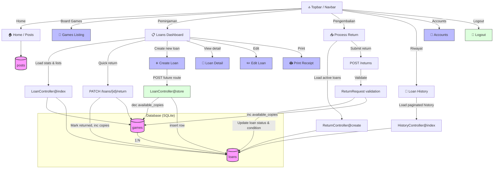
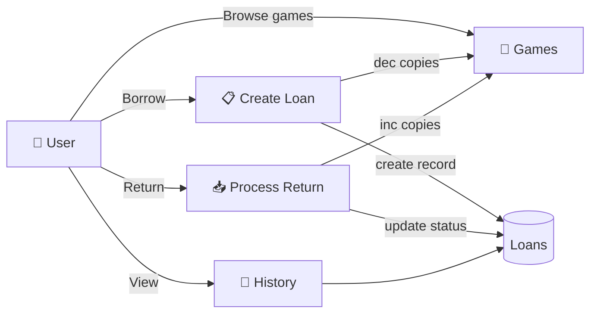
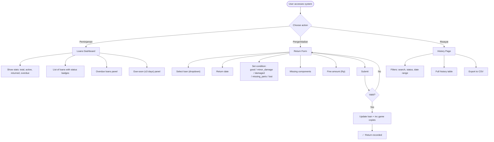

# Flowchart — Sistem Peminjaman Board Game

```mermaid
flowchart TD
    %% ========== STYLES ==========
    classDef db fill:#f9f,stroke:#333,stroke-width:2px
    classDef page fill:#bbf,stroke:#333,stroke-width:1px
    classDef action fill:#dfd,stroke:#333,stroke-width:1px
    classDef ext fill:#ffd,stroke:#333,stroke-width:1px

    %% ========== NAVIGATION (Top Bar) ==========
    TopBar["🔝 Topbar / Navbar"]
    TopBar -->|Home| HomePage["🏠 Home / Posts"]
    TopBar -->|Board Games| GamesPage["🎲 Games Listing"]:::page
    TopBar -->|Peminjaman| LoansIndex["📋 Loans Dashboard"]
    TopBar -->|Pengembalian| ReturnsCreate["📥 Process Return"]
    TopBar -->|Riwayat| HistoryIndex["📜 Loan History"]
    TopBar -->|Accounts| AccountsPage["👤 Accounts"]:::page
    TopBar -->|Logout| Logout["🚪 Logout"]:::action

    %% ========== HOME ==========
    HomePage --> PostDb[(posts)]:::db

    %% ========== LOANS FLOW ==========
    LoansIndex -->|Load stats & lists| LoanController["LoanController@index"]
    LoanController --> GameDb[(games)]:::db
    LoanController --> LoanDb[(loans)]:::db

    LoansIndex -->|Quick return| ReturnPatch["PATCH /loans/{id}/return"]
    ReturnPatch -->|Mark returned, inc copies| LoanDb
    ReturnPatch --> GameDb

    LoansIndex -->|Create new loan| LoansCreate["➕ Create Loan"]:::page
    LoansCreate -->|POST future route| LoanCreateAction["LoanController@store"]:::action
    LoanCreateAction -->|dec available_copies| GameDb
    LoanCreateAction -->|insert row| LoanDb

    %% ========== RETURN FLOW ==========
    ReturnsCreate -->|Load active loans| ReturnCreateCtrl["ReturnController@create"]
    ReturnCreateCtrl --> LoanDb

    ReturnsCreate -->|Submit return| ReturnStore["POST /returns"]
    ReturnStore -->|Validate| ReturnReq["ReturnRequest validation"]
    ReturnReq -->|Update loan status & condition| LoanDb
    ReturnReq -->|inc available_copies| GameDb

    %% ========== HISTORY FLOW ==========
    HistoryIndex -->|Load paginated history| HistoryCtrl["HistoryController@index"]
    HistoryCtrl --> LoanDb

    %% ========== OVERSEARCH / DETAIL ==========
    LoansIndex -->|View detail| LoanDetail["📄 Loan Detail"]:::page
    LoansIndex -->|Edit| LoanEdit["✏️ Edit Loan"]:::page
    LoansIndex -->|Print| LoanPrint["🖨️ Print Receipt"]:::page

    %% ========== DATA MODEL ==========
    subgraph Database["Database (SQLite)"]
        direction LR
        GameDb ---|1:N| LoanDb
    end
```

## Simplified User Flow

```mermaid
flowchart LR
    User["👤 User"] -->|Browse games| Games["🎲 Games"]
    User -->|Borrow| Loan["📋 Create Loan"]
    Loan -->|dec copies| Games
    Loan -->|create record| LoansDB[(Loans)]
    User -->|Return| Return["📥 Process Return"]
    Return -->|inc copies| Games
    Return -->|update status| LoansDB
    User -->|View| History["📜 History"]
    History --> LoansDB
```

## Core Business Logic

```mermaid
flowchart TD
    Start(["User accesses system"]) --> Nav{Choose action}

    Nav -->|Peminjaman| LoanDash["Loans Dashboard"]
    LoanDash --> Stats["Show stats: total, active, returned, overdue"]
    LoanDash --> LoanTable["List of loans with status badges"]
    LoanDash --> OverduePanel["Overdue loans panel"]
    LoanDash --> DueSoonPanel["Due-soon (≤3 days) panel"]

    Nav -->|Pengembalian| ReturnForm["Return Form"]
    ReturnForm --> SelectLoan["Select loan (dropdown)"]
    ReturnForm --> SetDate["Return date"]
    ReturnForm --> Condition["Set condition:
        good / minor_damage / damaged
        / missing_parts / lost"]
    ReturnForm --> MissingComp["Missing components"]
    ReturnForm --> Fine["Fine amount (Rp)"]
    ReturnForm --> SubmitReturn["Submit"]
    SubmitReturn --> Validate{Valid?}
    Validate -->|No| ReturnForm
    Validate -->|Yes| ProcessReturn["Update loan + inc game copies"]
    ProcessReturn --> Success["✅ Return recorded"]

    Nav -->|Riwayat| HistPage["History Page"]
    HistPage --> Filters["Filters: search, status, date range"]
    HistPage --> HistTable["Full history table"]
    HistPage --> ExportCSV["Export to CSV"]
```
